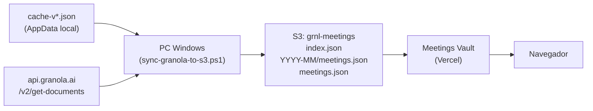
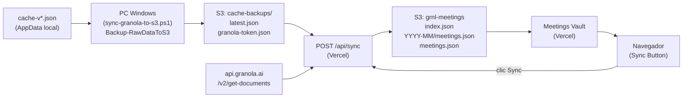
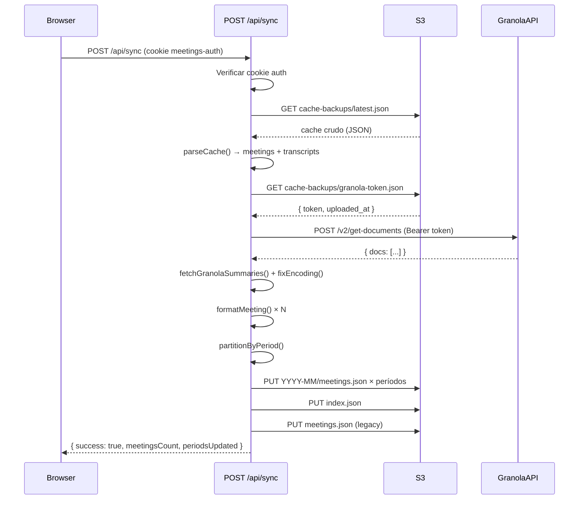

# Diseño: Cloud Sync Button

## Visión General

Esta feature desacopla la PC con Windows como único punto de procesamiento de la app Meetings Vault. Actualmente, el script PowerShell es el único componente capaz de leer el cache local de Granola, llamar a la API de Granola y generar los archivos JSON particionados en S3. Con este cambio, el script PowerShell pasa a ser únicamente un agente de backup (sube el cache crudo a S3), y la web app adquiere la capacidad de ejecutar el pipeline completo de sincronización desde cualquier dispositivo.

### Arquitectura actual (antes)



### Arquitectura nueva (después)



La PC sigue siendo necesaria para el backup inicial del cache, pero el procesamiento completo puede ejecutarse desde cualquier dispositivo con acceso a la web app.

---

## Arquitectura

### Componentes involucrados

| Componente | Tipo | Cambio |
|---|---|---|
| `sync-granola-to-s3.ps1` | PowerShell | Agregar función `Backup-RawDataToS3` |
| `app/api/sync/route.ts` | Next.js API Route | Reescritura completa (S3 en lugar de Postgres) |
| `app/page.tsx` | React Client Component | Agregar botón Sync con estados |
| `vercel.json` | Configuración Vercel | Agregar `maxDuration: 60` para `/api/sync` |

### Flujo de datos del Sync API



---

## Componentes e Interfaces

### 1. PowerShell: función `Backup-RawDataToS3`

Se agrega al final de `sync-granola-to-s3.ps1` y se llama al final de `Sync-Meetings`, después del upload existente.

```powershell
function Backup-RawDataToS3 {
    # 1. Detectar cache-v*.json más reciente en $env:APPDATA\Granola\
    $cacheFiles = Get-ChildItem "$env:APPDATA\Granola\cache-v*.json" -ErrorAction SilentlyContinue |
                  Sort-Object LastWriteTime -Descending
    if (-not $cacheFiles) {
        Write-Log "ERROR: No se encontró ningún archivo cache-v*.json" "ERROR"
        return
    }
    $latestCache = $cacheFiles[0]

    # 2. Subir cache crudo a S3 como cache-backups/latest.json
    aws s3 cp "$($latestCache.FullName)" "s3://$BUCKET_NAME/cache-backups/latest.json" ...

    # 3. Leer supabase.json, extraer token, subir a cache-backups/granola-token.json
    $supabase = Get-Content "$env:APPDATA\Granola\supabase.json" -Raw | ConvertFrom-Json
    $token = ($supabase.workos_tokens | ConvertFrom-Json).access_token
    $tokenPayload = @{ token = $token; uploaded_at = (Get-Date -Format "o") } | ConvertTo-Json
    # Subir $tokenPayload a s3://$BUCKET_NAME/cache-backups/granola-token.json
}
```

**Punto de llamada:** al final de `Sync-Meetings`, después de `Upload-ToS3`.

### 2. Next.js API Route: `POST /api/sync`

Reescritura completa de `app/api/sync/route.ts`. Elimina la dependencia de `@vercel/postgres`.

#### Funciones internas

```typescript
// Extrae meetings y transcripts del cache crudo
function parseCache(cacheData: unknown): { meetings: RawMeeting[], transcriptIndex: TranscriptIndex }

// Llama a api.granola.ai/v2/get-documents y construye índice de summaries
async function fetchGranolaSummaries(token: string): Promise<SummaryIndex>

// Corrige encoding Latin-1 → UTF-8 (espejo del fix del PowerShell)
function fixEncoding(str: string): string

// Construye el objeto meeting final con todos sus campos
function formatMeeting(raw: RawMeeting, transcriptIndex: TranscriptIndex, summaryIndex: SummaryIndex): FormattedMeeting

// Agrupa meetings por período YYYY-MM
function partitionByPeriod(meetings: FormattedMeeting[]): Record<string, FormattedMeeting[]>

// Sube todos los archivos generados a S3
async function uploadToS3(files: S3File[]): Promise<void>
```

#### Interfaz HTTP

| Aspecto | Detalle |
|---|---|
| Método | `POST` |
| Ruta | `/api/sync` |
| Auth | Cookie `meetings-auth` === `AUTH_SECRET` |
| Respuesta 200 | `{ success: true, meetingsCount: number, periodsUpdated: number }` |
| Respuesta 401 | `{ error: "Unauthorized" }` |
| Respuesta 404 | `{ error: "Cache backup not found in S3" }` |
| Respuesta 500 | `{ error: "...", details: string }` |
| Respuesta 502 | `{ error: "Granola API request failed", details: string }` |

#### Timeout en Vercel

El proceso completo (leer S3 + llamar Granola API + escribir S3) puede tomar 15-30 segundos con datasets grandes. El timeout por defecto de Vercel es 10s (60s en Pro). Se configura `maxDuration: 60` en `vercel.json` para la función `/api/sync`.

### 3. Frontend: botón Sync en `app/page.tsx`

Se agrega al header existente. Estados del botón:

```typescript
type SyncState = 'idle' | 'loading' | 'success' | 'error'
```

| Estado | Texto | Visual |
|---|---|---|
| `idle` | "Sync" | Botón normal |
| `loading` | "Sincronizando..." | Spinner, deshabilitado |
| `success` | "✓ N meetings" | Verde, 3s, luego vuelve a idle |
| `error` | Mensaje de error | Rojo, hasta próximo clic |

Al recibir respuesta exitosa, se llama automáticamente a `fetchMeetings()` para refrescar la lista.

---

## Modelos de Datos

### Cache crudo de Granola (entrada)

```typescript
interface GranolaCache {
  cache: {
    state: {
      documents: Record<string, RawMeeting>
      transcripts: Record<string, TranscriptSegment[]>
    }
  }
}

interface RawMeeting {
  id: string
  title: string
  created_at?: string
  updated_at?: string
  deleted_at?: string | null
  was_trashed?: boolean
  status?: string
  workspace_id?: string
  chapters?: unknown[]
  notes_markdown?: string
  notes_plain?: string
  people?: {
    creator?: { name: string; email: string }
    attendees?: Array<{ name: string; email: string }>
  }
  google_calendar_event?: {
    start?: { dateTime?: string }
  }
}

interface TranscriptSegment {
  document_id: string
  start_timestamp: number
  end_timestamp: number
  source: 'microphone' | 'system'
  text: string
}
```

### Meeting procesado (salida)

```typescript
interface FormattedMeeting {
  id: string
  title: string
  date: string           // ISO 8601
  updated_at?: string
  status?: string
  attendees: Array<{ name: string; email: string }>
  notes_markdown: string
  notes_plain: string
  summary: {
    html: string | null
    text: string
    bullets: string[]
  } | null
  transcript: Array<{
    start: number
    end: number
    speaker: 'me' | 'them'
    text: string
  }>
  chapters: unknown[]
  workspace_id?: string
}
```

### Token de Granola en S3

```typescript
interface GranolaTokenFile {
  token: string
  uploaded_at: string    // ISO 8601
}
```

### Índice S3 (index.json)

```typescript
interface S3Index {
  generated_at: string   // ISO 8601
  version: "2.0"
  total_meetings: number
  periods: Array<{
    period: string        // "YYYY-MM"
    count: number
    file: string          // "meetings-YYYY-MM.json"
    s3_key: string        // "YYYY-MM/meetings.json"
    first_meeting: string
    last_meeting: string
  }>
}
```

### Estructura S3 completa

```
s3://grnl-meetings/
├── cache-backups/
│   ├── latest.json              # Cache crudo de Granola (cache-v*.json)
│   └── granola-token.json       # { token: "...", uploaded_at: "..." }
├── index.json                   # Índice de períodos (version: "2.0")
├── meetings.json                # Todos los meetings (legacy, version: "1.0")
└── YYYY-MM/
    └── meetings.json            # Meetings del período
```

---

## Propiedades de Corrección

*Una propiedad es una característica o comportamiento que debe mantenerse verdadero en todas las ejecuciones válidas de un sistema — esencialmente, un enunciado formal sobre lo que el sistema debe hacer. Las propiedades sirven como puente entre las especificaciones legibles por humanos y las garantías de corrección verificables automáticamente.*

### Propiedad 1: Round-trip de serialización de meetings

*Para todo* conjunto de meetings procesados válidos, serializar a JSON y luego deserializar debe producir un objeto estructuralmente equivalente al original.

**Valida: Requisito 7.4**

### Propiedad 2: Idempotencia de la sincronización

*Para todo* cache backup en S3, ejecutar el Sync_API dos veces consecutivas con el mismo cache debe producir archivos `YYYY-MM/meetings.json`, `index.json` y `meetings.json` con contenido idéntico (excepto los campos `generated_at` / `exported_at`).

**Valida: Requisitos 6.2, 6.3**

### Propiedad 3: Completitud — ningún meeting válido se omite

*Para todo* cache backup que contenga N meetings con `id` y `title` definidos, sin `deleted_at` ni `was_trashed`, el resultado de `parseCache()` debe contener exactamente esos N meetings y ninguno más.

**Valida: Requisitos 2.3, 2.5**

### Propiedad 4: Corrección del fix de encoding

*Para toda* cadena de texto producida por la Granola API, aplicar `fixEncoding()` debe producir una cadena UTF-8 válida (sin caracteres de reemplazo U+FFFD).

**Valida: Requisito 2.9**

### Propiedad 5: Mapeo correcto de speakers en transcripts

*Para todo* segmento de transcript, si `source === "microphone"` entonces `speaker === "me"`, y si `source === "system"` entonces `speaker === "them"`.

**Valida: Requisito 2.4**

### Propiedad 6: Exclusión de meetings eliminados

*Para todo* meeting con `deleted_at` definido o `was_trashed === true`, ese meeting no debe aparecer en ningún archivo de salida generado por el Sync_API.

**Valida: Requisito 2.5**

---

## Manejo de Errores

### PowerShell (`Backup-RawDataToS3`)

| Condición | Comportamiento |
|---|---|
| No existe `cache-v*.json` | Log de error, continúa sin subir backup |
| Falla upload del cache a S3 | Log de error, continúa con el token |
| No existe `supabase.json` | Log de error, continúa sin subir token |
| Falla upload del token a S3 | Log de error |

La función no interrumpe el flujo principal de `Sync-Meetings` — los errores son no fatales.

### Sync API (`POST /api/sync`)

| Condición | HTTP | Respuesta |
|---|---|---|
| Cookie auth inválida o ausente | 401 | `{ error: "Unauthorized" }` |
| `cache-backups/latest.json` no existe en S3 | 404 | `{ error: "Cache backup not found in S3" }` |
| JSON del cache inválido o sin `cache.cache.state.documents` | 400 | `{ error: "Invalid cache format" }` |
| `cache-backups/granola-token.json` no existe en S3 | 500 | `{ error: "Granola token not found in S3" }` |
| Granola API retorna error HTTP | 502 | `{ error: "Granola API request failed", details: ... }` |
| Falla escritura a S3 | 500 | `{ error: "S3 upload failed", details: ... }` |
| Timeout de Vercel (>60s) | 504 | Error de plataforma (no controlable en código) |

### Frontend (botón Sync)

- Errores de red o HTTP ≥ 400: mostrar mensaje de error en rojo con el texto del campo `error` de la respuesta.
- El botón vuelve a estado `idle` al hacer clic cuando está en estado `error`.
- El estado `success` vuelve automáticamente a `idle` después de 3 segundos.

---

## Estrategia de Testing

### Testing unitario

Enfocado en ejemplos concretos, casos borde y condiciones de error:

- `parseCache()` con un cache válido → verifica conteo y estructura de meetings
- `parseCache()` con meetings que tienen `deleted_at` → verifica exclusión
- `parseCache()` con JSON inválido → verifica error descriptivo
- `fixEncoding()` con cadena ASCII pura → verifica que no cambia
- `fixEncoding()` con cadena con caracteres mal codificados → verifica corrección
- `formatMeeting()` sin `created_at` ni `google_calendar_event` → verifica fallback a fecha actual
- `partitionByPeriod()` con meetings de distintos meses → verifica agrupación correcta
- Sync API con cookie inválida → verifica HTTP 401
- Sync API sin cache en S3 → verifica HTTP 404

### Testing basado en propiedades (PBT)

Se usa una librería de PBT para TypeScript (recomendado: **fast-check**). Cada test de propiedad debe ejecutar mínimo 100 iteraciones.

```typescript
// Instalación
// npm install --save-dev fast-check
```

Cada test debe incluir un comentario de trazabilidad:

```typescript
// Feature: cloud-sync-button, Propiedad 1: Round-trip de serialización de meetings
it('round-trip serialización', () => {
  fc.assert(fc.property(arbFormattedMeeting, (meeting) => {
    const serialized = JSON.stringify(meeting)
    const deserialized = JSON.parse(serialized)
    expect(deserialized).toEqual(meeting)
  }), { numRuns: 100 })
})
```

#### Tests de propiedad requeridos

| Tag | Propiedad | Generador |
|---|---|---|
| `Propiedad 1` | Round-trip serialización | `fc.record(...)` con campos de `FormattedMeeting` |
| `Propiedad 2` | Idempotencia de sync | Cache fijo, dos llamadas a `parseCache` + `partitionByPeriod` |
| `Propiedad 3` | Completitud del parseo | Array de N meetings válidos embebidos en estructura de cache |
| `Propiedad 4` | Corrección de encoding | `fc.string()` con caracteres Latin-1 |
| `Propiedad 5` | Mapeo de speakers | `fc.record({ source: fc.constantFrom('microphone', 'system'), ... })` |
| `Propiedad 6` | Exclusión de eliminados | Meetings con `deleted_at` o `was_trashed` generados aleatoriamente |

### Consideraciones de integración

- El Sync API depende de S3 y de la Granola API externa. Los tests de integración deben mockear ambas dependencias.
- El test de idempotencia (Propiedad 2) puede ejecutarse contra S3 real en un bucket de staging, o contra un mock de `@aws-sdk/client-s3`.
- El timeout de Vercel (60s) debe monitorearse en producción con logs de duración en cada ejecución del Sync API.
